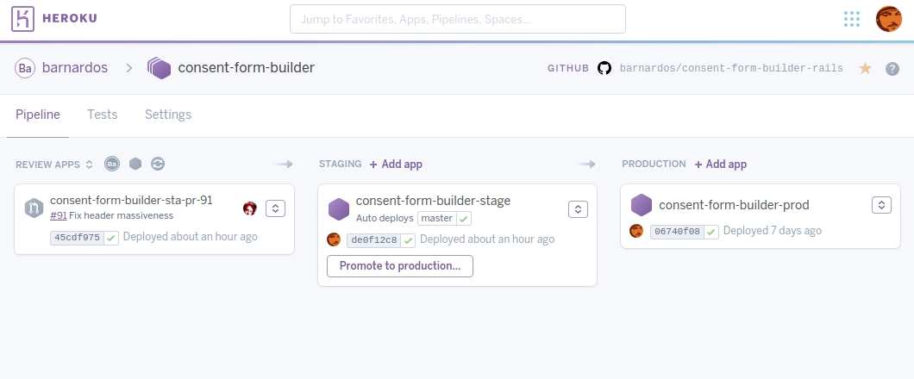

# GitHub Flow and Heroku Release Process

## Introduction

There are two main schools of thought when it comes to releasing code or services to the world, **continuous deployment** and **fixed releases**.

The idea behind continuous deployment is that a team works on a new feature, checks it and releases it to the world. Continuous deployment has the benefit that the service/product changes often and is able to respond to new requirements quickly with a simple process for managing source code changes. The drawbacks of this approach include issues such as requiring thorough test coverage and it can be difficult to co-ordinate changes with external dependencies such as database schemes or API’s.

In the fixed release approach changes are worked on and batched together into a new "version". The benefits are that co-ordination with other dependencies can be easily managed and there is more time to catch potential issues. Releases can also be planned so that users are made aware ahead of time if changes affect them. The downsides include a slower turnaround time for new features and a more complex source code management process.

In both of approaches it is important to have automated build/release tools configured to manage the process and catch potential issues.

This guide concentrates on the continuous deployment approach and outlines how to implement it using GitHub, CircleCI and Heroku. The same approach can be applied to other architectures but these tools provide the easiest to manage solution.

## Continuous Deployment

In continuous deployment a developer makes a change, it is reviewed and approved and release it. This approach allow fast turnaround of changes but is more risky as, without the correct controls in place, it is very easy to "break the build". In order to implement continuous deployment a number of elements must be implemented:

- Source code management
- Testing
- Deployment

### Source Code Management
At the heart of this approach is the use of an approach to source code change management named [GitHub Flow](https://guides.github.com/introduction/flow/).

In GitHub Flow you have one central branch of code, the ‘Master’ branch. Master represents the code that is currently live, the code you can trust. Do NOT check broken or incomplete code into Master EVER! Bad things will happen, if you are lucky you’ll only loose your job.

A typical scenario for working on a few feature would comprise of:

1. Create a branch from Master, with a sensible name for the thing to be created, e.g. ‘add_ears_to_panda’.
2. Work on code and commit changes to the ‘add_ears_to_panda’ branch. This can be one or more commits.
3. Once the work for the new feature is ready, the developer pushes it to GitHub and creates a ‘Pull Request’, describing the changes that have been made.
4. Automated checks and tests are run against the code
5. Another developer checks the code and offers feedback.
6. The Pull Request is approved and the code is then ready to merge to master.
7. The branch is merged back into master and the code is deployed.

Things get a little more complicated when other developers are also branching from master and it changes while you are working on your feature. It is good practice to carry out regular ‘re-basing’, this involves getting the latest copy of Master and re-laying your changes on top of it. This isn’t as scary as it sounds, but it can be a little intimidating to start with. Some teams carry out regular ‘merges’ of master back onto their branch, this can also work and the decision on the best approach is down to the team. The ultimate aim is to apply your changes on top of the current Master once they are complete.

Merging to master is risky, once you merge the code it will be put live, so you must be sure. Pull Requests (PR) are sanity checks made by other developers' to ensure the code is good. PR's give developers to opportunity to offer advice, guidance, and spot silly mistakes. More information about PR's can be found in the Github section of the Developer Manual.

*Users 1 and 2 creates branch from master*

*User 1 finishes a feature, raises a PR, gets approval and the changes are merged into Master*

*User 2 finishes their work and 're-bases' the feature branch, so now it acts like a branch from the current version of master*

*User 2 creates a PR, it is approved and the changes are then merged into master. Master now has both features*

### Testing
With such as wild, fearless, living on the edge approach there are risks: even with PR’s it’s incredibly easy to ‘break the build’. The best safety net is tests, lots and lots of tests. As part of agreeing to use the GitHub Flow approach it is important that the team agrees a testing strategy.

This approach discusses the mix of 'Unit' tests and 'User Acceptance Tests(UAT)'. 

#### Unit Tests
Unit tests focus on testing one small piece of code at a time and and execute extremely quickly. They allow functions and modules to be tested in  wide range of simulated scenarios. 

When writing unit tests you must also find a good 'mocking' library. Imagine function `showContacts()` gets a list of contacts, by calling `getContacts()` does some transformation then renders them by calling `res.render(template, contacts)`. A mocking tool will allow you to say that if the function calls `getContacts()` then return some fake data and when it calls `res.render()` test the parameters.

If developing using Ruby, then it is recommended that you use [RSpec](http://rspec.info/) to test your code. Users of Node JS have a range of tools available, the top two being [Mocha](https://mochajs.org) and [Jasmine](https://jasmine.github.io),

#### User Acceptance Tests
Unit tests only test functions in isolation but don't test your application as a whole, for this you can use User Acceptance Tests.

There are a wide range of UAT tools, and the best one to use depends upon the tools used to build the service. The granddaddy of all UAT tools is [Cucumber]('https://www.cucumber.io'), which is the best tool to use for Ruby based projects. For Node based projects there is [Nightwatch]('https://www.nightwatchjs.org'), which borrow much from Cucumber.

Nightwatch and Cucumber have two things in common, they use a language to describe tests called 'Gherkin' and control a web browser using Selenium Webdriver.

Gherkin is a human readable language that anyone can understand and contribute to that describes a test. A typical test would look like this:

    Feature: Create a new contact
      As an existing user
      I would like to create contacts

      Scenario: Create a new contact
        Given I have logged in
        When I create a new contact
        Then I see the updated contact record confirmation message
        And I verify that my newly created contact is present in search results

The test is broken down into a number of steps, the granularity to be agreed by the team. The steps shown here are at a high level, but you may want to specify the parameters to use when creating something. It's up to you to decide how to form your tests, but **the ultimate aim is to test your service well enough to be confident you can release it with no human intervention**.

The steps are mapped to function calls in your test code (library dependent) and these functions drive a browser using Webdriver to manipulate and inspect the browser DOM.

If you write step code so that it talks directly to Webdriver it will produce 'fragile' tests. Every time you change your HTML you risk it instantly breaking many tests. It is advisable to create a layer of abstraction between your steps and the code used to call Webdriver. This approach centralises the code that knows about individual label names, class names etc. into one place so that if the frontend is updated you only need to change the support code in one place.

    When(/^I create a new contact$/) do
      goto_page('/contact/add')
      fill_contact_form(name: 'Fred', phone:'1234', email: 'Fred@test.com')
      submit_form()
    end

    def fill_contact_form(name: '', phone: '', email: '') do
      fill_in 'Full name', with: name
      fill_in 'Phone number', with: phone
      fill_in 'Email address;, with: email
    end

Creating these test should be part of working on a new feature. PR's should not be signed off or features merged until there are tests that prove it works.

Setting up a machine to run tests can sometimes be tricky (depending upon the tool used) and they take longer to run. Encourage developers to setup their environment so they can run them when working on features. Must UAT allow you to 'tag' tests and then tell the test runner which tags to run, allowing you to tag a test with the name of the feature you are working on so you can just run those tests while working on it, and then run all tests when done.

Another way of speeding up running browsers tests is to use a 'headless' browser. Google recently introduced [headless Chrome](https://chromium.googlesource.com/chromium/src/+/lkgr/headless/README.md). Headless browsers allow tests to run much faster, as they dont have to wait to update the screen, and are less intrusive (When you run tests with a regular browser you can't do anything else with your PC while they are running).  Webdriver can be configured to launch Chrome in headless mode so it can be run fast, without taking over your desktop and can be ran by CI services such as Circle and Travis.

    "selenium_port": 4444,
      "selenium_host": "localhost",
      "silent": true,
      "desiredCapabilities": {
        "javascriptEnabled": true,
        "acceptSslCerts": true,
        "browserName": "chrome",
        "chromeOptions" : {
          "args" : ["headless", "no-sandbox", "disable-gpu"]
        }
      }
*Example webdriver config for headless Chrome*

The exact configuration depends on the UAT tool used, for example there are [alternative configuration methods for Capybara](https://robots.thoughtbot.com/headless-feature-specs-with-chrome)

Setup for your UAT should be flexible enough to allow it to run against a range of browsers and devices.

Running locally against a headless browser is practical, but eventually you need to run UAT against as many browsers, and mobile devices, as possible (find out what you users are using).

Webdriver and the test launcher can be setup so that different browsers can be used for testing, and a tool called [Selenium Cluster](http://www.seleniumhq.org/docs/07_selenium_grid.jsp) enables a dedicated machine, or machines, to provide access to a wide range of browsers and even mobile devices. Setting up a Selenium cluster to work with webdriver to support all the browsers and devices you need to test against can be Hard and is a full time job, especially as browsers are constantly changing and some require additional libraries loading which also change often. [BrowserStack](https://www.browserstack.com/) runs an online service that acts as a remote Selenium cluster and has virtual machines setup with every browser and OS combination you will ever need. The best thing is they offer the service for free to open source projects. If your project is public and has an open licence then contact Browser Stack and request a free account, then put a brief thank you to Browser Stack in your project read me file.

So Ultimately:
- Run the UAT tests for your feature locally, headless, often.
- Configure your CI and source control to run all the UAT tests headless for each check-in
- Configure your CI and source control to require all UAT to be ran on real browsers before a PR can be approved and merged to master.

### Continuous integration
Continuous Integration (CI) and automated deployment brings the whole thing together. Your CI platform, deployment environment and source code management need to work hand in hand. This guide focuses on using Github, Circle CI and Heroku together to manage all these steps.

Continuous integration is the act of testing code every time it is checked in, this normally consists of making sure the code can be built, adheres to any coding style rules (linting) and that tests pass. It should be possible to run a subset of tests for every checking and another more exhaustive set for Pull Requests (though not sure how this is done using Circle CI).

Circle CI offers an excellent CI service that has a free tier and integrates with Github and Heroku. When code is pushed to GitHub it notifies Circle which checks out the code and executes scripts in a virtual machine (Though Circle have just added workflow and Docker support). Circle is smart enough to recognise a project type from it's source code, so for instance if the project has a `package.json` then it will automatically run `npm install` and `npm test`. Default behaviour can be overridden via a `circleci.yml` file.

    # circle.yml
    
    dependencies:
      override:
        - yarn
      pre:
        - yarn install
        - bundle install
    machine:
      environment:
        PATH: "${PATH}:${HOME}/${CIRCLE_PROJECT_REPONAME}/node_modules/.bin"
      node:
        version: v8.1.3
    test:
      override:
        - bundle exec rake

At this time it is not clear how to setup Circle to run different tests for regular commits and pull requests.

#### GitHub
Github provides an excellent platform not just to track source code changes and manage PR's, but also to set rules about when things canA and can't be released by protecting branches. With Github Flow you must protect your Master branch.

Within the settings page for a repository in Github you can go to the 'branches' tab and choose to protect a branch. Within the settings for branch protection there are a number of options, and these should be set according to policies agreed with the team. You should set the branch to require status checks that will be made by the CI service (in this case Circle CI) and set that PR's require pull requests. It's also a good idea to include administrators: you may be the admin for your code and accidentally try to push direct to master

#### Heroku
You have your code controlled by GitHub, and Circle CI is setup to check your tests pass, the final piece to the puzzle is deployment.

Deploying applications can be hard, scaling them harder and managing those platforms and keeping them secure is harder still. Heroku provides a 'Platform As A Service' (PAAS). What does this mean? You point Heroku at your project and ask it to deploy it, next thing you know it's running your service and gives you a URL to access it. Heroku takes care of setting up the hardware, Operating System, required software, security, code deployment: you literally just say deploy. Heroku has the added benefit that you can bolt on extra services, so you configure it to provide a Postgresql database and Redis.

The Heroku Pipeline feature can be setup to atomically deploy changes made to the Master branch and associate a live URL with it, whilst pull request can automatically deploy a temporary copy of the platform to a URL based on the pull request name, so the anyone can take a look at the code and voice their feedback or help find issues.

Heroku is extremely flexible and can configured to scale from the smallest to the largest loads. As Heroku takes care of the majority of the 'hard' stuff associated with running a platform it can provide savings over maintaining a dedicated set of servers and operations staff, though once platforms become large those economies of scale change.

#### Bringing it all together
This all sounds like a lot, but it's not really. When you work on a feature this is what typically happens:

- The developer creates a branch and makes a bunch of changes and writes tests to prove it works
- The developer creates a PR in Github describing their new feature
- Circle CI is informed of the pull request and the commit and gets a copy of the code
- Circle CI runs it's tests and informs GitHub of the result
- Heroku is notified of the PR and wait for Github to notify it that the CI tests have passed, once they have Heroku deploys a copy of the service to a URL based on the PR name and notifies Github so it can show a link in the PR request.
- Developers look at the code and comment on it whilst the product manager tries it out at the site Heroku setup.
- The Pull request is approved, Github allows the code to be merged because all the tests pass so the code is merged into master
- Heroku is notified that a commit has been pushed to Master and so deploys the code to the product server 

